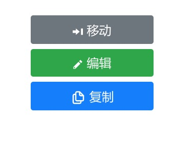

# copy-rap-api-plugin



进入 RAP 的某个接口文档页后，会在上图所示区域生成一个复制按钮，点击该按钮就可以以下面的格式复制当前页面的接口，然后粘贴到 mock 文件中：

复制的接口举例：
```json
"POST /dinecenter/v1/public/orgList": {
  "bizContent": {
    "resultList": [
      {
        "orgId": 252,
        "orgLevel": 1,
        "orgName": "会员名称",
        "parentId": 0,
        "orgCode": "1010110",
        "orgFullCode": "1010110-",
        "sortNum": 0,
        "children": [],
        "leaf": true
      }
    ]
  },
  "code": 200,
  "message": "成功",
  "subCode": "SUCCESS",
  "timeout": 0
},
```